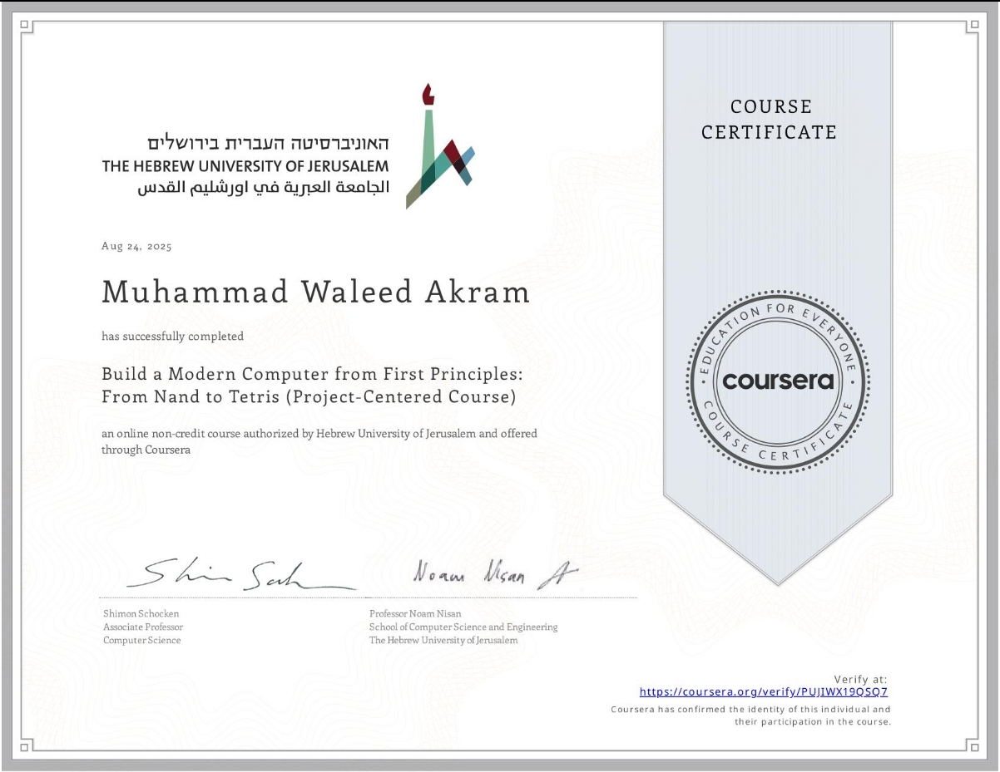

# 🖥️ Nand2Tetris Hack Computer

This repository contains my completed projects for the course  
**Build a Modern Computer from First Principles: From Nand to Tetris**.  
The course takes you on a journey from constructing elementary logic gates all the way to building a fully functional computer system.

---

## 📂 Project Structure

- **project_01_boolean_logic**  
  Basic logic gates built from NAND: AND, OR, XOR, MUX, DMUX, etc.

- **project_02_alu_arithmetic**  
  Arithmetic circuits including Half Adder, Full Adder, and the Hack ALU.

- **project_03_memory**  
  Sequential logic: Flip-flops, Registers, RAM units.

- **project_04_machine_language**  
  Programming in Hack Assembly (examples: Mult.asm, Fill.asm).

- **project_05_computer**  
  Integration of the CPU, Memory, and Instruction handling to create the Hack Computer.

- **project_06_assembler**  
  Assembler that translates Hack Assembly into binary machine code.

---

## 🚀 Tools Used

- **[Nand2Tetris Web IDE](https://nand2tetris.github.io/web-ide/chip/)**  
  Used for designing and testing HDL components.

---

## ✨ Highlights

✔️ Built everything **from scratch** – no black boxes  
✔️ Each project has its own **README.md** for documentation  
✔️ Final outcome: a working **Hack Computer** 🖥️  

---

## 👨‍💻 Author

**Muhammad Waleed Akram**  
📍 Electrical Engineering Student | Enthusiast in Computer Architecture & Systems Design  

---

## 📜 Certificate

I successfully completed this course, got 100% Marks and finally earned a certificate of completion 🎓  

  
 

---

## 📜 Acknowledgement

This work follows the legendary course by **Noam Nisan** and **Shimon Schocken**:  
*The Elements of Computing Systems (From Nand to Tetris)*  

---
